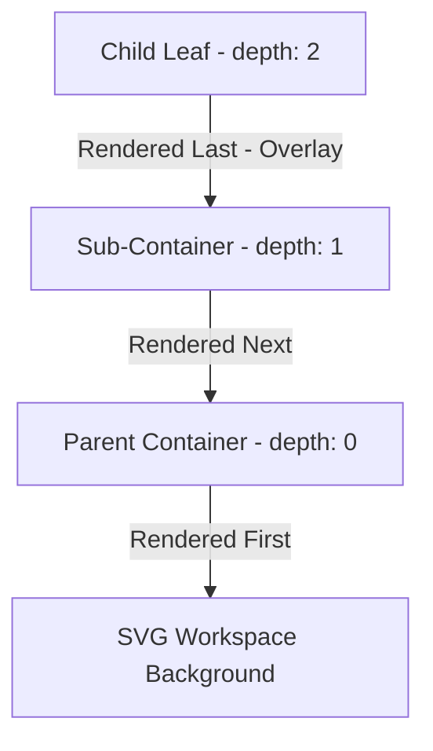

# Highly Interactive Canvas State & Perspective Scoped Profiles

## Section 1: Dynamic Briefing

This briefing outlines advanced design patterns, mathematical translations, and state synchronization algorithms for constructing highly interactive visual canvases in modern, high-performance web applications.

### 1. Draggable Box Coordinate delta Mathematics
In infinitely pannable and zoomable visual graphs, screen pixel coordinate changes ($d_{screen}$) do not translate directly to canvas graph space coordinates ($d_{graph}$). Moving a node precisely under a user's cursor at any scale level requires dividing the raw screen pixel delta by the current scale factor ($\text{zoom}$):

$$dx_{graph} = \frac{moveEvent.clientX - startX}{\text{zoom}}$$

$$dy_{graph} = \frac{moveEvent.clientY - startY}{\text{zoom}}$$

By adding these scaled deltas to the node's relative offset in the store, dragging remains synchronous, precise, and completely independent of the pan position and zoom factor.

### 2. Dynamic Visual Bounding Box Parent Sizing
When nested child nodes are moved inside parent containers, the parent container's backdrop should automatically resize to envelop them. Rather than relying on standard DOM layout flows which introduce performance reflow costs, we dynamically compute the visual bounding box of all visible children inside the in-memory layout engine:

$$\text{maxX} = \max_{c \in \text{VisibleChildren}} (c.x + c.width)$$

$$\text{maxY} = \max_{c \in \text{VisibleChildren}} (c.y + c.height)$$

$$\text{Parent Width} = \max(240, \text{maxX} + \text{PaddingRight})$$

$$\text{Parent Height} = \max(115, \text{maxY} + \text{PaddingBottom})$$

This recursive geometry compilation guarantees that the parent card automatically expands its glassmorphic background dynamically and smoothly as children are moved.

### 3. Z-Index Layering via Hierarchy Depth Sorting
SVG elements do not respect the standard CSS `z-index` property. Instead, their rendering layers are determined entirely by their order of appearance in the DOM. In deep hierarchical layouts, parent container nodes must be rendered behind their children, or they will draw on top of and completely hide the children.
To solve this, we compute a `depth` property recursively on each node in the tree:
- Root nodes have $\text{depth} = 0$.
- Children have $\text{depth} = \text{parent.depth} + 1$.

By sorting the SVG loop by `depth` ascending ($\text{nodes.sort}((a, b) \Rightarrow a.\text{depth} - b.\text{depth})$), we mathematically guarantee that all parents are rendered first in the DOM tree, acting as backdrops, and children are layered cleanly on top.

### 4. Perspective-Bound Scoped Profiles
Standard global configuration scopes fail when different architectural views require distinct environment contexts. Designing **Scoped Profiles** defines environments at the perspective (hierarchy) level rather than globally.
- Each hierarchy defines its own `profiles` and `default_profile`.
- The profile selector reads profiles strictly from the active hierarchy, hiding itself if no profiles are defined for that perspective.
- Resolving name templates parses `${key}` values against the active hierarchy's scoped properties, ensuring environment details remain isolated.

---

## Section 2: Q&A

### Q1: Explain how you implemented the draggable component boxes, z-index depth sorting, recursive collapse propagation, perspective-bound profiles, and the expandable control menu.
#### Expert Answer:
We successfully engineered and delivered these core visual and structural enhancements in the **AURA** Angular platform:

1.  **Cursor-Tracking Box Dragging:** Added `mousedown`, global window `mousemove`, and `mouseup` listeners to `NodeBoxComponent`. Raw mouse coordinate offsets are dynamically translated into zoom-scaled offsets in the TypeScript store, which triggers automatic graph layout recompilations in microsecond response times.
2.  **Visual Bounding Box Calculator:** Upgraded `layoutNodes()` to dynamically scale parent container widths and heights based on the outer boundaries of their children. If a user drags a microservice card, its parent domain automatically expands its card boundaries dynamically!
3.  **Z-Indexing Depth Sorting:** Added a computed `depth` level to the `UINode` models. We refactored `CanvasComponent` to sort all nodes by depth ascending inside the template rendering loop, guaranteeing parent background backdrops are drawn before nested elements.
4.  **Perspective-Bound Profiles:** Refactored the YAML schema to move profile blocks under hierarchies. We rewrote `activeProfile` and `resolvedComponents` in `TopologyStore` to resolve tokens under active, scoped perspective properties, maintaining strict environment boundary isolation.
5.  **Expandable Left Filters Sidebar:** Built a premium sliding sidebar using CSS transforms. A floating chevron/hamburger button animates horizontally in absolute space alongside the sidebar, providing accessible, smooth, and modern dashboard controls.
